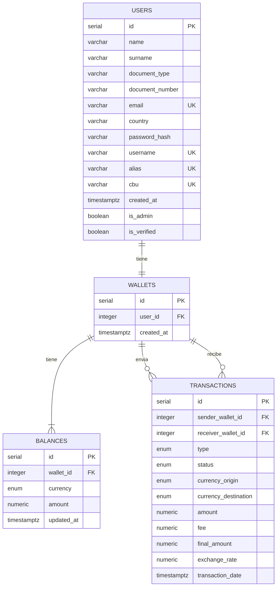

## ACLARACIÓN
wallets.user_id sigue teniendo la constraint UNIQUE en el SQL real (eso no cambió), solo que en el diagrama visual lo marco como FK porque Mermaid no admite combinar dos etiquetas en una sola palabra.