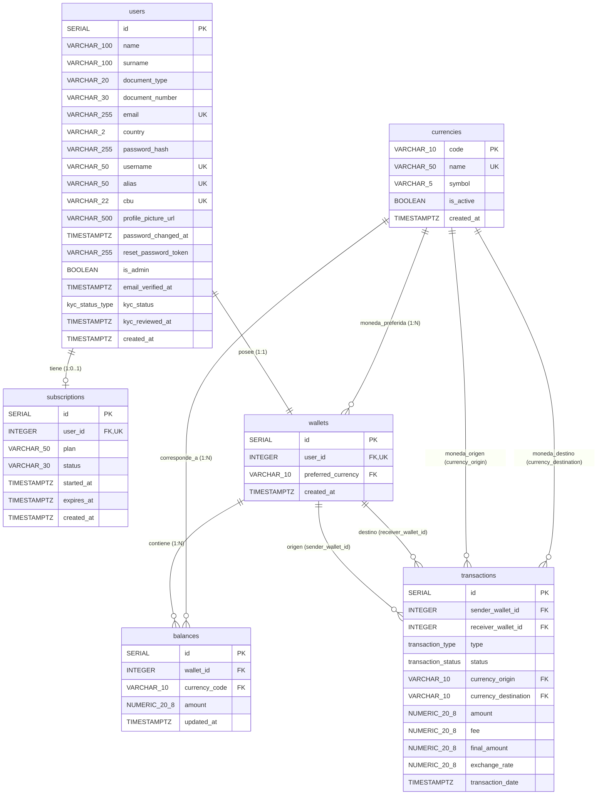

| # | Relación | Cardinalidad | Descripción |
|---|---|---|---|
| 1 | users → wallets | 1 : 1 | Cada usuario tiene exactamente una wallet. |
| 2 | users → subscriptions | 1 : 0..1 | Un usuario puede no tener suscripción o tener como máximo una. |
| 3 | wallets → balances | 1 : N (mín. 1) | Cada wallet tiene uno o más balances, uno por moneda. |
| 4 | wallets → transactions (emisor) | 1 : N (puede ser 0) | Una wallet puede haber originado transacciones. |
| 5 | wallets → transactions (receptor) | 1 : N (puede ser 0) | Una wallet puede haber recibido transacciones. |
| 6 | currencies → balances | 1 : N (puede ser 0) | Una moneda puede estar en varios balances. |
| 7 | currencies → transactions (origen) | 1 : N (puede ser 0) | Una moneda puede ser origen de transacciones. |
| 8 | currencies → transactions (destino) | 1 : N (puede ser 0, nullable) | Nullable porque en transfer no hay conversión. |
| 9 | currencies → wallets (preferida) | 1 : N (puede ser 0) | Una moneda puede ser preferida por varias wallets. |

## ACLARACIÓN
wallets.user_id sigue teniendo la constraint UNIQUE en el SQL real (eso no cambió), solo que en el diagrama visual lo marco como FK porque Mermaid no admite combinar dos etiquetas en una sola palabra.